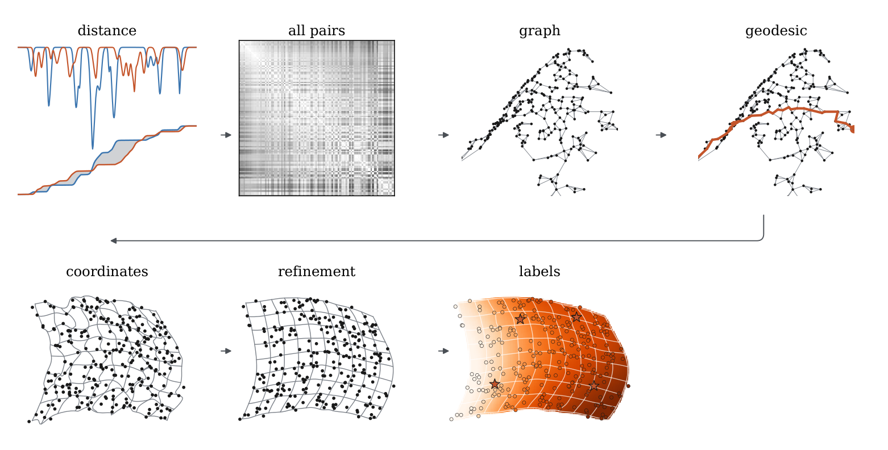

# Armillary

Armillary builds a coordinate system for a spectroscopic survey from the spectra alone, and then transfers labels (effective temperature, surface gravity, abundances, or anything else measured for a few stars) to every other star through that coordinate system. It needs no model spectra and no training set to place the stars; labels enter only at the end, and a few dozen labelled stars are enough for a survey of hundreds of thousands. The method is described in Ting & Saad (2026), *Armillary: a label-free coordinate system for stellar spectra*; this repository is the package that implements it, with a tutorial on synthetic spectra.



*From left to right: two spectra and their cumulative absorption curves, whose separation is the distance between them; the table of distances between all pairs; the neighbour graph on the manifold the spectra trace out; a geodesic along it; the coordinates that reproduce the geodesic distances; the same after the locally linear refinement; and labels carried from four labelled stars (the orange stars) to every other star.*

## How it works

Every spectrum is normalised to a local continuum and turned into a set of cumulative absorption curves, one per wavelength chunk at several chunk sizes; the distance between two spectra is the sum over chunks of the area between their curves (a one-dimensional Wasserstein distance). Each star is joined to its nearest neighbours under that distance, the graph is made connected, and distances along the graph become coordinates by landmark multidimensional scaling. The coordinates are then refined so that every star is the same local linear combination of its neighbours in coordinate space as it is in spectrum space, and labels are carried through those same local combinations from the labelled stars to all the others.

| step | module | what it computes |
| --- | --- | --- |
| 1 | `armillary.preprocess`, `armillary.distance` | the locally normalised flux; the feature vectors whose L1 distance is the spectral distance |
| 2 | `armillary.lattice` | the k-nearest-neighbour graph, connected, and geodesic distances from a set of landmarks |
| 3 | `armillary.coordinates` | the coordinates, by landmark multidimensional scaling |
| 4 | `armillary.refine` | the locally linear refinement of the coordinates |
| 5 | `armillary.labels` | the label transfer through the same local weights |
| | `armillary.pipeline` | `Config`, `fit` and `Fit`: the whole chain with timings |
| | `armillary.evaluate` | the error statistic and the probes used to score coordinates and transferred labels |

## Installation

Python 3.10 or newer.

```bash
git clone https://github.com/tingyuansen/armillary-package.git
cd armillary-package
python -m pip install -e .
```

This installs the package and its dependencies (NumPy, SciPy, scikit-learn, numba, pynndescent). The distance kernels are compiled with numba on first use; `Config.threads` or the environment variable `NUMBA_NUM_THREADS` sets the number of cores. For the tests and the tutorial:

```bash
python -m pip install -e ".[test,tutorial]"
python -m pytest tests            # a few seconds
jupyter lab armillary_tutorial.ipynb
```

## Quick start

```python
import numpy as np, armillary as ar

z = np.load("examples/synthetic_spectra.npz")
flux = z["flux"].astype(np.float32)          # [N, P] continuum-normalised flux
good = np.ones(flux.shape, bool)             # [N, P] usable pixels
segments = np.zeros(flux.shape[1], int)      # [P] detector segment of every pixel

F = ar.fit(flux, good, segments, ar.Config.paper_synthetic())
C = F.C                                      # the coordinates, [N, d]

labelled = np.arange(0, len(flux), 42)       # the stars whose labels are known
Y = F.propagate(z["labels"], labelled_index=labelled)   # labels for every star, [N, 3]
```

`fit` returns a `Fit` holding every intermediate product (the normalised flux, the feature vectors, each star's neighbours and distances, the graph, the eigenvalues, the unrefined and refined coordinates, the timings of every step). `Fit.propagate` transfers any table of labels; `Fit.save(path)` writes the coordinates and what is needed to draw or re-score them.

## The tutorial

[`armillary_tutorial.ipynb`](armillary_tutorial.ipynb) runs the whole method on the grid of 4,675 synthetic spectra in `examples/synthetic_spectra.npz` (calculated with [Payne Zero](https://github.com/tingyuansen/payne-zero), 480 to 680 nm at a resolving power of 10,000: every combination of effective temperature from 4000 to 7000 K, surface gravity from 1 to 5 and metallicity from −2 to +0.5, each with its true labels). It shows, in the figures of the paper:

1. the showcase: the label grid recovered in the coordinates with no label used, at three metallicities (the paper's Figure 3);
2. the seven steps of the schematic above, and where each product sits on the `Fit`;
3. labels transferred from 50 stars to the other 4,625, and the same at a signal-to-noise ratio of 30;
4. how the calls apply to a real survey.

It runs in about a minute on a laptop. `examples/tutorial_figures.py` holds the figures and `examples/figure_style.py` the paper's typography, for reuse.

## Configuration

Every parameter of the method is a field of `Config`, documented in `armillary/pipeline.py`. Three presets reproduce the paper's runs:

| preset | survey | what it sets |
| --- | --- | --- |
| `Config()` = `Config.paper_apogee()` | APOGEE, pipeline-normalised spectra | three detector segments, chunkings of (4, 4, 3), (8, 7, 5) and (16, 14, 10) chunks per segment, four coordinates, every star a landmark, exact neighbour search |
| `Config.paper_apogee_survey()` | APOGEE at survey scale | 800 landmarks, nearest-neighbour descent, `mu = 3` for the transfer |
| `Config.paper_desi()` | DESI, spectra with their instrumental response | a running continuum first, four chunkings, the absorption weighted by the pixel errors, 800 landmarks, nearest-neighbour descent |
| `Config.paper_synthetic()` | the synthetic grid and the tutorial | one segment, one chunking of 32 chunks, three coordinates, 50 neighbours for the refinement |

The fields that matter most when adapting the method to a new survey are `chunkings` (the wavelength chunks per detector segment, coarse to fine), `continuum` (`"none"` for spectra that arrive normalised, `"running"` for spectra with their response), `error_weights` (weight each pixel's absorption by its inverse variance, for surveys whose errors carry sky and detector structure), `d` (the number of coordinates; read it from `Fit.eigenvalues`), and `search` (`"exact"` up to a few tens of thousands of stars, `"nndescent"` beyond). A configuration can be saved to and loaded from JSON with `Config.save` and `Config.load`.

## Input format

`fit(flux, good, segments, config, err=None)`:

- `flux`: `[N, P]` float, the spectra on a common wavelength grid, continuum-normalised unless `continuum="running"`;
- `good`: `[N, P]` bool, False on bad pixels (they take no part in any fit and carry no absorption);
- `segments`: `[P]` int, the detector segment of every pixel, numbered from 0, so that chunks never straddle a gap;
- `err`: `[N, P]` float, needed for `continuum="running"` and `error_weights=True`.

Labels for `Fit.propagate` are an `[N, L]` array (rows for every star of the fit, any values on the unlabelled rows) with `labelled_index` naming the rows whose values are known.

## Tests

```bash
python -m pytest tests                       # the fast tests, a few seconds
ARMILLARY_APOGEE_CUBE=/path/to/apogee_cube.npz python -m pytest tests -m slow   # nn-descent against the exact search on the paper's APOGEE test cube
```

They check the feature vectors against the pixel-level integral of the distance, landmark scaling against classical multidimensional scaling, the conjugate-gradient refinement and transfer against dense solves, that bridging makes the graph connected, and the nearest-neighbour descent against the exact search.

## Citation

If you use Armillary, please cite Ting & Saad (2026), *Armillary: a label-free coordinate system for stellar spectra*.

## Licence

MIT, see `LICENSE`.
